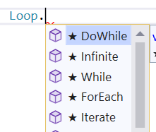

# Bigoudi

Un package pour faire des boucles.

## Usage

Add `using Bigoudi;` at the begining of the file. Then you can use the `Loop` class and `ForEach` extension method.



### For loop

```cs
Loop.For(i => testOutputHelper.WriteLine($"i = {i}"), 6, 1, 2);
```

is equivalent of

```cs
for (int i = 1; i < 6; i += 2) { i => testOutputHelper.WriteLine($"i = {i}"); }
```

Outputs:

```
i = 1
i = 3
i = 5
```

`start` and `increment` parameters are optionals and defaults to respectively 0 and 1. So to make a simple "for loop" from 0 to 9 you can simply write:

```cs
Loop.For(i => { }, 10);
```

### Iterate loop

Iterate is an alternative to `For` where you can set the number of iterations wanted instead of a "length".

```cs
Loop.Iterate(i => testOutputHelper.WriteLine($"i = {i}"), 3, 1, 2);
```

Outputs:

```
i = 1
i = 3
i = 5
```

### While loop

```cs
int i = 0;
Loop.While(() => testOutputHelper.WriteLine($"i = {i}"), () => i++ < 3);
```

Outputs:

```
i = 1
i = 2
i = 3
```

### DoWhile loop

```cs
int i = 0;
Loop.DoWhile(() => testOutputHelper.WriteLine($"i = {i}"), () => i++ < 3);
```

Outputs:

```
i = 0
i = 1
i = 2
i = 3
```

### ForEach loop

```cs
int[] ints = { 1, 2, 3 };

Loop.ForEach(ints, i =>
{
    testOutputHelper.WriteLine($"i = {i}");
});
```

Outputs: 

```
i = 1
i = 2
i = 3
```

### ForEach loop with extension method

```cs
int[] ints = { 1, 2, 3 };

ints.ForEach(i =>
{
    testOutputHelper.WriteLine($"i = {i}");
});
```

Outputs: 

```
i = 1
i = 2
i = 3
...
```

### Infinite loop

```cs
CancellationTokenSource cts = new CancellationTokenSource();
cts.CancelAfter(TimeSpan.FromSeconds(1));
try
{
    var execute = () => { testOutputHelper.WriteLine("execute..."); Thread.Sleep(100); };
    await Task.Run(() => Loop.Infinite(cts.Token, execute), cts.Token);
}
catch (OperationCanceledException)
{
    testOutputHelper.WriteLine("loop ended");
}
```

Outputs:

```
execute...
execute...
execute...
execute...
execute...
execute...
execute...
execute...
execute...
execute...
loop ended
```